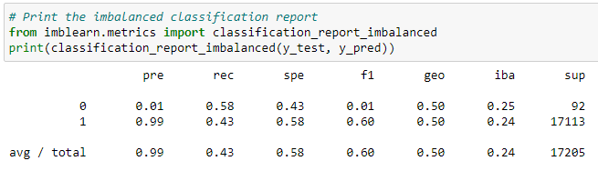

# Credit_Risk_Analysis
oversampling credit score data to evaluate credit risk performance via machine learning modules

## Overview

Jill was impressed with our work we provided early on in the module. Now, we are to apply machine learning to the real-world challenge of credit card risk. Jill asks us to utilize the imbalanced-learn and scikit_learn libraries to evaluate the credit risk models. In this particular issue of credit risk analysis, there is a disparity between the high risk and low risk loans. We will use two machine learning models to predict credit risk. The two machine learning models are BalancedRandomForestClassifier and EasyEnsembleClassifier.

## Results
  
* Note that "0" represents "high risk" population and "1" represents "low risk" population
  
### RandomOverSampler Model

From the random oversampler model, T=the balanced accuracy score is approximately 60.9%. The high risk precison score for this model appears 1% with a F1 score of 2%. Due to the higer number of those in the low risk population, its precision shows almost a 100% result with a sensitivity of 66%.

### SMOTE Model
 
 
 
 
After running and evaluating the SMOTE Model, we can see the model is similar to the random sampler model.
- The balanced accuracy score shows approximately a score of 63.5% 
- The high risk precision is about 1% with only 62% which then yeilds a f1 score of 2%
- The precision of this model is also approximately 100% with a sensitivity of 65%.

### Cluster Centroids Model

- In this model, the balanced accuracy score is down to 50.2%
- However, the high risk precision score is still appearing as 1% with a 58% sensitivity, thus yeilding a F1 of 1%
- Due to this models higher number of false positives, the low risk sensitivity is appearing as 43%.

### SMOTEENN Model

- In this SMOTEENN Model, we observe the balanced accuracy score is 64.9%
- The high risk precision score this time shows a 71% sensitivity with 1% and a F1 score of 2%
- Due to this model also having a greater number of false positives, the low risk sensitivity is 59%

### BalancedRandomForestClassifier Model

![](Resources/
![](Resources/

- In the BalancedRandomForestClassifier, we observe the balanced accuracy score is 75.1%.
- The high risk precision is appearing as 3% with a 63% sensitivity, thus leading to a F1 of 5%
- The low risk sensitivity is now 87% with 100% accuracy

### EasyEnsembleClassifier Model

- In this model, we see it is similar to the BalancedRandomForest Model in the sense the balanced accuracy is a little higher at 75.2%
- The high risk precision score is appearing at 3& with a 63& sensitivity score as well as a F1 of 5%
- The low risk is also 87&

## Summary

After performing and evaluating the numerous models, we determined that the Ensemble models showed more improvement in determining a high credit risk than the other models. The EasyEnsembleClassifier model shows the highest score of 75.2% while also showing a 87% sensitivity in detecting low risk credit scores. In this particular scenario, none of these model is close to being perfect in determining credit risk as they all have room for error and would not recommend a particular model to use.
